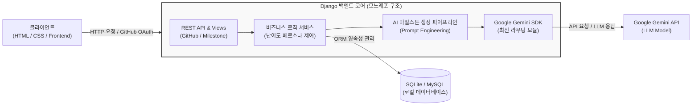

```mermaid
flowchart LR
    Client["클라이언트\n(HTML / CSS / Frontend)"] -->|HTTP 요청 / GitHub OAuth| Server["Django 백엔드 서버"]

    subgraph Server ["Django 백엔드 코어 (모노레포 구조)"]
        direction LR
        API["REST API & Views\n(GitHub / Milestone)"] --> Service["비즈니스 로직 서비스\n(난이도 페르소나 제어)"]
        Service --> Pipeline["AI 마일스톤 생성 파이프라인\n(Prompt Engineering)"]
        Pipeline --> ClientSDK["Google Gemini SDK\n(최신 라우팅 모듈)"]
    end

    ClientSDK -->|API 요청 / LLM 응답| External["Google Gemini API\n(LLM Model)"]
    Service -->|ORM 영속성 관리| DB[("SQLite / MySQL\n(로컬 데이터베이스)")]
    
    style Server fill:#f9f9f9,stroke:#333,stroke-width:2px
```
